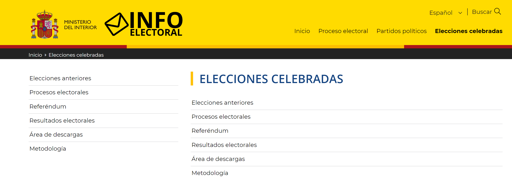

# Paquete de Datos Electorales

Este paquete proporciona herramientas para descargar, procesar y analizar datos electorales del gobierno español, relativas a elecciones pasadas. Incluye funciones para descargar archivos de datos, leer y procesar tablas de datos electorales, y visualizar los resultados en mapas.

## Instalación

Para instalar este paquete, debs tener R y el sistema de gestión de paquetes `devtools` instalados. Luego, puedes instalar el paquete desde el repositorio local o remoto.

```r
# Instalar devtools si no está instalado
install.packages("devtools")

# Instalar el paquete desde el repositorio local
devtools::install_local("ruta/al/paquete/electoral")
```
## Uso
A continuación se describen las principales funciones del paquete.
### `LecturaDatos.R`
#### `descargar_Archivo`

Descarga un archivo desde la fuente de datos electorales del gobierno.

**Parámetros:**

- `tipo_eleccion`: Tipo de elección (e.g., 'referendum', 'congreso', 'senado', 'municipales', 'cabildos', 'europeas').
- `año`: Año de la elección.
- `mes`: Mes de la elección.
- `ambito`: Ámbito de la elección (e.g., 'mesa', 'municipio', 'superior').
- `directorio`: Directorio donde se guardará el archivo descargado (por defecto es "./descargas/").

**Retorno:**

La ruta del directorio donde se ha descargado el archivo.

**Ejemplo:**

```r
descargar_Archivo(tipo_eleccion = "municipales", año = 2023, mes = '05', ambito = "mesa")
```
#### `leer_tabla`

Descarga y procesa archivos de datos electorales según los parámetros especificados.

**Parámetros:**

- `tipo_eleccion`: Tipo de elección (e.g., 'referendum', 'congreso', 'senado', 'municipales', 'cabildos', 'europeas').
- `año`: Año de la elección.
- `mes`: Mes de la elección.
- `ambito`: Ámbito de la elección (e.g., 'mesa', 'municipio', 'superior').
- `directorio`: Directorio donde se guardarán los archivos descargados (por defecto es "./descargas/").
- `tabla`: Código de la tabla de datos a procesar (por defecto es '05').

**Retorno:**

Un `data.frame` con los datos procesados de las elecciones.

**Ejemplo:**

```r
df <- leer_tabla(tipo_eleccion = "congreso", año = 2019, mes = '04', ambito = "mesa")
```
#### `get_elecciones`

Obtiene datos de elecciones históricas filtrados según el tipo y el año especificados.

**Parámetros:**

- `tipo`: El tipo de elección a filtrar. Puede ser uno de los siguientes: 'referendum', 'congreso', 'senado', 'municipales', 'cabildos', 'europeas'. Si se especifica, la función filtrará los datos para incluir solo las entradas que correspondan a este tipo. Debe ser un carácter. Si es `NULL`, no se aplica filtro por tipo.
- `año`: El año de las elecciones a filtrar. Si se especifica, la función filtrará los datos para incluir solo las entradas de ese año específico. Si es `NULL`, no se aplica filtro por año.

**Retorno:**

Un `data.frame` que contiene las columnas del archivo CSV original, filtrado según los criterios especificados y con los códigos de tipo de elección traducidos a texto.

**Detalles:**

La función lee un archivo CSV que contiene el histórico de elecciones y filtra los datos según los parámetros proporcionados. Si se especifica un tipo, la función filtrará los datos para incluir solo los registros correspondientes a ese tipo de elección. Si se especifica un año, solo se incluirán los registros de ese año. Los códigos de tipo de elección en el `data.frame` se traducen a texto.

**Ejemplo:**

```r
# Obtener todas las elecciones de tipo 'congreso' en 2021
get_elecciones(tipo = "congreso", año = 2021)

# Obtener todas las elecciones del año 2020
get_elecciones(año = 2020)

# Obtener todas las elecciones de tipo 'municipales'
get_elecciones(tipo = "municipales")
```

#### `get_elecciones`

Obtiene datos de elecciones históricas filtrados según el tipo y el año especificados.

**Parámetros:**

- `tipo`: El tipo de elección a filtrar. Puede ser uno de los siguientes: 'referendum', 'congreso', 'senado', 'municipales', 'cabildos', 'europeas'. Si se especifica, la función filtrará los datos para incluir solo las entradas que correspondan a este tipo. Debe ser un carácter. Si es `NULL`, no se aplica filtro por tipo.
- `año`: El año de las elecciones a filtrar. Si se especifica, la función filtrará los datos para incluir solo las entradas de ese año específico. Si es `NULL`, no se aplica filtro por año.

**Retorno:**

Un `data.frame` que contiene las columnas del archivo CSV original, filtrado según los criterios especificados y con los códigos de tipo de elección traducidos a texto.

**Detalles:**

La función lee un archivo CSV que contiene el histórico de elecciones y filtra los datos según los parámetros proporcionados. Si se especifica un tipo, la función filtrará los datos para incluir solo los registros correspondientes a ese tipo de elección. Si se especifica un año, solo se incluirán los registros de ese año. Los códigos de tipo de elección en el `data.frame` se traducen a texto.

**Ejemplo:**

```r
# Obtener todas las elecciones de tipo 'congreso' en 2021
get_elecciones(tipo = "congreso", año = 2021)

# Obtener todas las elecciones del año 2020
get_elecciones(año = 2020)

# Obtener todas las elecciones de tipo 'municipales'
get_elecciones(tipo = "municipales")
```
#### `descripcion_tabla`

Devuelve la descripción asociada a un prefijo de tabla específico.

**Parámetros:**

- `tabla`: Un carácter que indica el prefijo de la tabla. Debe ser un número de dos dígitos como '01', '02', etc.

**Retorno:**

Una cadena con la descripción del fichero asociado al prefijo dado.

**Detalles:**

Esta función proporciona una descripción textual del tipo de archivo asociado con el prefijo de tabla especificado. Los prefijos corresponden a diferentes tipos de archivos relacionados con los datos electorales y su descripción ayuda a entender la función de cada archivo.

**Ejemplo:**

```r
# Obtener la descripción del archivo con el prefijo '05'
descripcion_tabla('05')

# Obtener la descripción del archivo con el prefijo '09'
descripcion_tabla('09')
```
#### `leer_varias_tablas`

Descarga y procesa múltiples archivos de datos electorales basados en los parámetros especificados.

**Parámetros:**

- `tipo_eleccion`: Un carácter que indica el tipo de elección de entre 'referendum', 'congreso', 'senado', 'municipales', 'cabildos' o 'europeas'.
- `año`: Un número que indica el año de la elección.
- `mes`: Un número que indica el mes de la elección.
- `ambito`: Un carácter que indica el ámbito de la elección, puede ser 'mesa', 'municipio' o 'superior'.
- `directorio`: Un carácter que indica el directorio donde se guardarán los archivos descargados. Por defecto es `"./descargas/"`.
- `tablas`: Un vector de caracteres que contiene los códigos de las tablas de datos a procesar.

**Retorno:**

Una lista de `data.frames`, cada uno conteniendo los datos procesados de una tabla específica.

**Detalles:**

Esta función utiliza `lapply` para aplicar la función `leer_tabla` a cada código de tabla en el vector `tablas`. Descarga y procesa los archivos de datos electorales para cada tabla especificada y devuelve una lista de `data.frames`, donde cada `data.frame` corresponde a una tabla de datos.

**Ejemplo:**

```r
# Especificar los códigos de las tablas a procesar
tablas <- c("05", "07", "09")

# Leer los datos electorales para las tablas especificadas
datos_electorales <- leer_varias_tablas("congreso", 2021, 6, "superior", "./descargas/", tablas)

# Mostrar los datos de la primera tabla
head(datos_electorales[[1]])
```
### Mapas.R
#### `crear_mapa_provincias`

Crea un mapa de las provincias de España coloreado por una variable específica.

**Descripción:**

Esta función toma un `dataframe` y una variable de interés, y genera un mapa de las provincias de España coloreado según los valores agregados de la variable especificada.

**Parámetros:**

- `df`: Un `dataframe` que contiene datos de población por provincias.
- `variable`: La variable del `dataframe` cuyo total se desea representar en el mapa.

**Retorno:**

Un mapa de las provincias de España coloreado por la variable especificada.

**Ejemplo:**

```r
# Crear un mapa de provincias coloreado por votos en blanco
crear_mapa_provincias(df, df$votos_en_blanco)
```
**Importa:**
- `dplyr`
- `ggplot2`
- `sf`
- `giscoR`
- `stats`

#### `crear_mapa_CCAA`

Crea un mapa de las Comunidades Autónomas (CCAA) de España coloreado por una variable específica.

**Descripción:**

Esta función toma un `dataframe` y una variable de interés, y genera un mapa de las Comunidades Autónomas de España coloreado según los valores agregados de la variable especificada.

**Parámetros:**

- `df`: Un `dataframe` que contiene datos de población por provincias.
- `variable`: La variable del `dataframe` cuyo total se desea representar en el mapa.

**Retorno:**

Un mapa de las Comunidades Autónomas de España coloreado por la variable especificada.

**Ejemplo:**

```r
# Crear un mapa de CCAA coloreado por la proporción de primera vuelta
crear_mapa_CCAA(df, df$prop_primera_vuelta)

```
### Mapas.R

#### `mapa_provincia_secciones`

Crea un mapa de secciones censales de una provincia específica coloreado por una variable particular.

**Descripción:**

Esta función genera un mapa de secciones censales para una provincia específica en España, coloreado según los valores de una variable dada. La función utiliza la distancia de Levenshtein para encontrar el nombre de la provincia más cercano y realiza un join entre los datos de municipios y un `dataframe` reducido basado en esta proximidad.

**Parámetros:**

- `df`: Un `dataframe` que contiene los datos a mapear.
- `variable`: Nombre de la columna en `df` que contiene los valores a visualizar en el mapa.
- `provincia`: Nombre de la provincia para la cual se generará el mapa.

**Retorno:**

Un objeto ggplot que representa el mapa de la provincia con las secciones coloreadas según los valores de la columna especificada. Los valores ausentes se representan en gris.

**Ejemplo:**

```r
# Crear un mapa de secciones censales para la provincia de Valladolid coloreado por votos en blanco
mapa_provincia_secciones(df, df$votos_en_blanco, "Valladolid")
```
### `Tablas.R`
### Funciones de Análisis de Datos

#### `tabla_participacion`

Calcula y muestra tablas de participación basadas en el tipo de elección y provincia.

**Descripción:**

Esta función carga datos electorales para un tipo y fecha especificados, opcionalmente filtrando por provincia. Luego calcula resúmenes de participación y muestra los resultados en forma tabular. Si se especifica una provincia, filtra los datos para esa provincia usando los códigos INE.

**Parámetros:**

- `tipo_eleccion`: Tipo de elección como texto.
- `año`: Año de la elección.
- `mes`: Mes de la elección.
- `provincia`: Nombre de la provincia (opcional).

**Retorno:**

Un `dataframe` invisible con los resultados de participación y una impresión en consola de los resultados detallados.

**Detalles:**

- Si se especifica una provincia, la función convierte el nombre a minúsculas, busca el código INE correspondiente y filtra los datos para esa provincia.
- Calcula y muestra la tabla de participación utilizando la función `resultados_tabla_participacion`.

**Ejemplo:**

```r
# Calcular y mostrar la tabla de participación para la provincia de Valladolid
tabla_participacion("congreso", 2021, 6, "Valladolid")
```
#### `resultados_tabla_participacion`

Calcula los resultados de participación para un `dataframe` dado.

**Descripción:**

Dada una tabla de datos, esta función suma los votos y calcula los porcentajes de participación para diferentes categorías como avances de votación, votos en blanco y votos nulos. Si el tipo de elección es un referéndum, también procesa votos afirmativos y negativos.

**Parámetros:**

- `df`: `Dataframe` con los datos electorales.
- `tipo_eleccion`: Tipo de elección para determinar si se incluyen resultados de referéndum.

**Retorno:**

Un `dataframe` con las categorías de votación y sus totales y porcentajes.

**Detalles:**

- Calcula los totales y porcentajes de participación para "Primer avance", "Segundo avance", "Votos en blanco" y "Votos nulos".
- Si el tipo de elección es 'referendum' o 'referéndum', también calcula y muestra los resultados de votos afirmativos y negativos.
- Imprime los resultados en consola en un formato tabular, con los totales y porcentajes de cada categoría.

**Ejemplo:**

```r
# Calcular y mostrar resultados de participación para un referéndum
resultados_tabla_participacion(df, "referendum")
```
